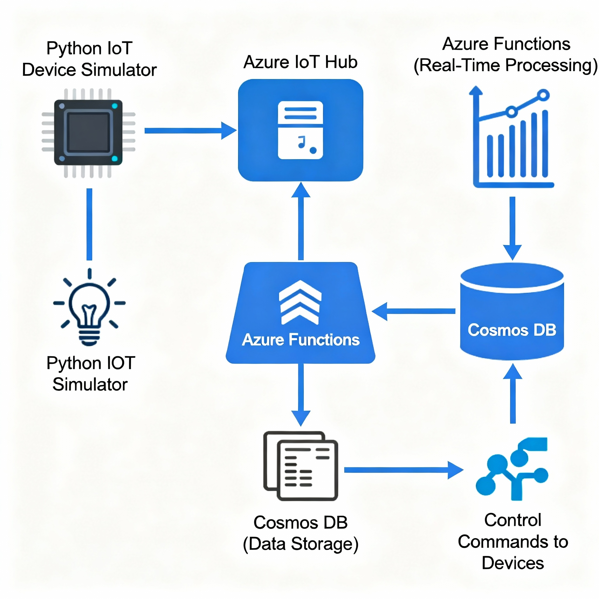
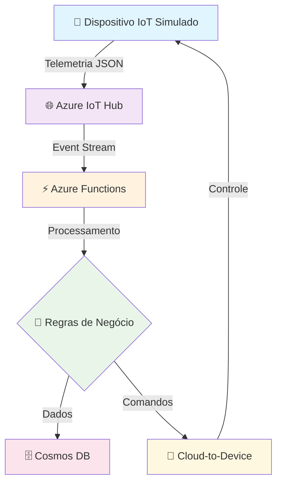

# 🏢 Case de Portfólio: Simulador de IoT para Edifícios Inteligentes com Azure (Smart HVAC PoC)

[](https://opensource.org/licenses/MIT)
[](https://www.python.org/downloads/)
[](https://azure.microsoft.com/)
[](https://azure.microsoft.com/services/iot-hub/)

Este projeto é uma **Prova de Conceito (PoC)** de um sistema de IoT ponta a ponta para monitoramento e controle de sistemas de climatização (HVAC) em edifícios inteligentes, construído inteiramente sobre a plataforma Microsoft Azure e simulado com Python.

O sistema simula múltiplos sensores de temperatura enviando telemetria para a nuvem, onde uma lógica serverless processa esses dados, armazena em um banco de dados NoSQL e envia comandos de volta aos dispositivos para otimizar a temperatura ambiente e o consumo de energia.

## 📊 Visão Geral do Projeto

Este projeto demonstra competências em:
- **Arquitetura de IoT na Nuvem** com Azure
- **Desenvolvimento Serverless** com Azure Functions
- **Processamento de Dados em Tempo Real**
- **Banco de Dados NoSQL** (Cosmos DB)
- **Simulação de Dispositivos IoT** com Python
- **Infraestrutura como Código (IaC)**

---

## 🏗️ Arquitetura da Solução

A arquitetura foi desenhada para ser **escalável**, **resiliente** e de **baixa latência**, utilizando serviços PaaS (Platform as a Service) do Azure para focar na lógica de negócio.

 

### 🔄 Fluxo de Dados



### 🎯 Componentes Principais

| Componente | Responsabilidade | Tecnologia Azure |
|------------|------------------|------------------|
| **Device Layer** | Simulação de sensores de temperatura | Azure IoT Device SDK |
| **Ingestion Layer** | Recepção segura de telemetria | Azure IoT Hub |
| **Processing Layer** | Lógica de negócio e regras | Azure Functions |
| **Storage Layer** | Persistência de dados | Azure Cosmos DB |
| **Command & Control** | Envio de comandos aos dispositivos | IoT Hub Cloud-to-Device |

---

## 🛠️ Stack Tecnológico

<div align="center">

### 🌐 Plataforma Cloud
[](https://azure.microsoft.com/)

### 💻 Linguagens & Frameworks
[](https://www.python.org/)
[](https://www.json.org/)

### 🔧 Serviços Azure
[](https://azure.microsoft.com/services/iot-hub/)
[](https://azure.microsoft.com/services/functions/)
[](https://azure.microsoft.com/services/cosmos-db/)

### 🛠️ Ferramentas & DevOps
[](https://docs.microsoft.com/cli/azure/)
[](https://code.visualstudio.com/)
[](https://git-scm.com/)

</div>

### 📋 Detalhes Técnicos

| Componente | Tecnologia | Função |
|------------|------------|---------|
| **Cloud Platform** | Microsoft Azure | Hospedagem e orquestração de todos os serviços |
| **Device Simulation** | Python 3.9 + azure-iot-device SDK | Simulação de sensores IoT reais |
| **Data Ingestion** | Azure IoT Hub | Recepção segura e escalável de telemetria |
| **Event Processing** | Azure Functions (Event Hub Trigger) | Processamento serverless de eventos em tempo real |
| **Data Storage** | Azure Cosmos DB (NoSQL API) | Armazenamento escalável e distribuído globalmente |
| **Infrastructure** | Azure CLI Scripts | Provisionamento automatizado de recursos |
| **Development** | Visual Studio Code + Azure Extensions | Ambiente de desenvolvimento integrado |

---

## ✨ Funcionalidades

- **Simulação de Telemetria em Tempo Real:** O script `sensor.py` simula um dispositivo IoT real, enviando dados de temperatura em formato JSON em intervalos regulares.
- **Lógica de Negócio na Nuvem:** Uma Azure Function processa cada mensagem recebida, aplicando uma regra de negócio (ex: se a temperatura > 24°C).
- **Armazenamento Persistente e Escalável:** Os dados de telemetria são armazenados em um container do Cosmos DB, particionados por `deviceId` para otimização de consultas.
- **Ciclo de Comando e Controle (C2D):** A Azure Function envia comandos de volta ao dispositivo simulado (ex: "LIGAR_AC") quando a regra de negócio é acionada, fechando o ciclo de automação.
- **Infraestrutura como Código (IaC) via Scripts:** O projeto inclui um script (`scripts/deploy_azure_resources.sh`) com comandos da Azure CLI para provisionar toda a infraestrutura na nuvem de forma automatizada.

---

## 📂 Estrutura do Projeto

```
.
├── docs/                 # Documentação e diagramas
├── scripts/              # Scripts de automação e deploy (IaC)
├── src/                  # Código-fonte da aplicação
│   ├── azure_function/   # Projeto da Azure Function (processador de telemetria)
│   └── device_simulator/ # Script Python do sensor simulado
├── .gitignore            # Arquivos e pastas a serem ignorados pelo Git
└── README.md             # Este arquivo
```

---

## 🚀 Como Executar a Simulação

### 📋 Pré-requisitos

Certifique-se de ter os seguintes itens instalados e configurados:

#### ☁️ Conta Azure
- [ ] Conta no Azure com uma **assinatura ativa**
- [ ] Permissões para criar recursos (IoT Hub, Functions, Cosmos DB)
- [ ] Azure CLI instalado e autenticado

#### 💻 Ambiente Local  
- [ ] **Python 3.8+** instalado
- [ ] **pip** (gerenciador de pacotes Python)
- [ ] **Git** para controle de versão
- [ ] **Visual Studio Code** com extensões:
  - Azure Functions
  - Azure IoT Tools
  - Python Extension

#### 🔧 Ferramentas de Linha de Comando
```bash
# Verificar instalações
python --version          # Python 3.8+
az --version              # Azure CLI
git --version             # Git
code --version            # VS Code
```

### 1. Provisionar a Infraestrutura no Azure
Execute o script de setup para criar todos os recursos necessários (IoT Hub, Cosmos DB, Function App).
```bash
# Faça login na sua conta do Azure
az login

# Execute o script de provisionamento
bash scripts/deploy_azure_resources.sh
```
*(Nota: Você precisará preencher o script `deploy_azure_resources.sh` com os comandos `az cli`)*

### 2. Configurar o Ambiente Local
Após o deploy, atualize as Connection Strings nos arquivos de configuração:
- `src/device_simulator/sensor.py`: Atualize a `CONNECTION_STRING` do dispositivo.
- `src/azure_function/local.settings.json`: Atualize as `IOTHUB_CONNECTION_STRING` e `COSMOSDB_CONNECTION_STRING`.

### 3. Iniciar a Simulação
- **Terminal 1: Inicie a Azure Function**
  ```bash
  cd src/azure_function
  pip install -r requirements.txt
  func start
  ```
- **Terminal 2: Inicie o Simulador do Sensor**
  ```bash
  cd src/device_simulator
  pip install -r requirements.txt
  python sensor.py
  ```

### 4. Observar os Resultados

#### 📊 Monitoramento em Tempo Real

| Local | O que Observar | Exemplo |
|-------|---------------|---------|
| **Terminal do Sensor** | Telemetria enviada e comandos recebidos | `Enviando: {"temperatura": 25.3, "timestamp": "2024-09-24T10:30:00Z"}` |
| **Terminal da Function** | Logs de processamento | `Processando temperatura: 25.3°C - Ação: LIGAR_AC` |
| **Cosmos DB** | Documentos JSON persistidos | Container `leituras_temperatura` |
| **Azure Portal** | Métricas do IoT Hub | Mensagens/segundo, dispositivos conectados |

#### 🔔 Eventos Esperados
1. **📡 Telemetria Contínua**: Dados de temperatura enviados a cada 10 segundos
2. **⚡ Processamento Automático**: Function triggerada por cada mensagem
3. **💾 Persistência**: Dados salvos no Cosmos DB
4. **🎛️ Controle Inteligente**: Comandos enviados quando temperatura > 24°C

#### 🐛 Troubleshooting
- **Sem telemetria?** Verifique a connection string do dispositivo
- **Function não executa?** Verifique as configurações do IoT Hub
- **Erro no Cosmos DB?** Verifique as permissões e connection string

---

## ⏭️ Roadmap e Melhorias Futuras

### 🔄 DevOps & Automação
- [ ] **CI/CD Pipeline** com GitHub Actions para deploy automático
- [ ] **Infrastructure as Code** com Bicep ou ARM Templates
- [ ] **Containerização** do simulador com Docker
- [ ] **Monitoramento** com Application Insights

### 📊 Analytics & Visualização
- [ ] **Azure Stream Analytics** para análises complexas em tempo real
- [ ] **Dashboard Power BI** conectado ao Cosmos DB
- [ ] **Alertas** via Azure Monitor e Logic Apps
- [ ] **Machine Learning** para predição de consumo energético

### 🏢 Funcionalidades de Negócio
- [ ] **Multi-tenant** para diferentes edifícios
- [ ] **Geolocalização** dos sensores
- [ ] **Histórico** de consumo energético
- [ ] **API REST** para integração com sistemas externos

### 🔒 Segurança & Compliance
- [ ] **Certificados X.509** para autenticação de dispositivos
- [ ] **Azure Key Vault** para gerenciamento de secrets
- [ ] **Logs de auditoria** completos
- [ ] **LGPD/GDPR** compliance

---

## 📞 Contato & Suporte

Desenvolvido por **Eduardo** - Engenheiro de Dados & IA

[](https://linkedin.com/in/seu-perfil)
[](https://github.com/edu-data-dev)
[](mailto:eduardo.dataengineer@gmail.com)

---

<div align="center">

### ⭐ Se este projeto foi útil, considere dar uma estrela!

**Licença:** MIT | **Status:** Em Desenvolvimento | **Versão:** 1.0.0

</div>